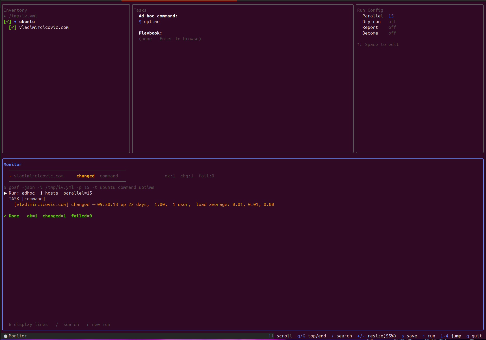
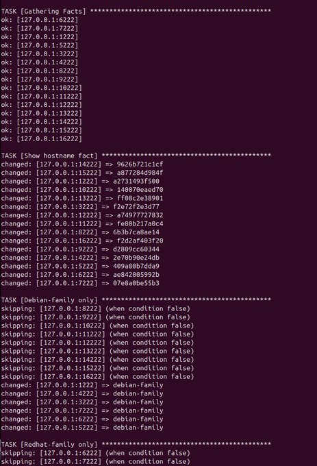
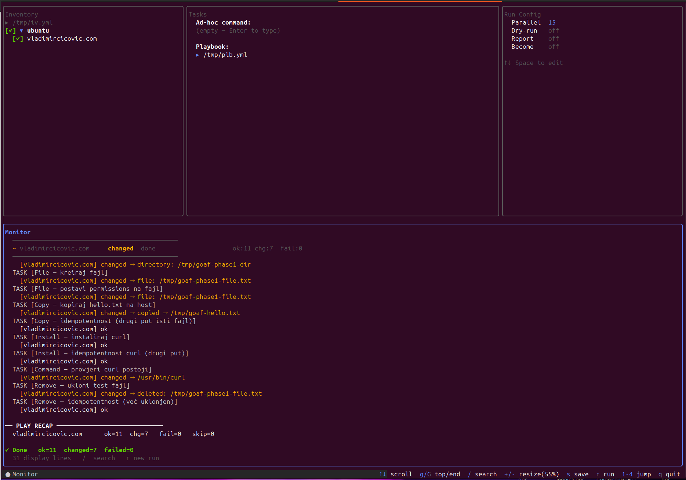

## Goaf
Go automatization framework

In mines explotation language: goaf(broken overburden rock)

In tehnical Go language: Go Automatization Framework 

#### Main idea
Use all benefit of Go language to build most valuable automatization framework. 
Build code to live, live for building code. 

## Who give idea?
Zeeshan Khan E 12 July 4:10 2019 PM Automation Framework in Go Lang

Build faster and better Ansible (it is continus process)

But Ansible done excelent aproach and save million years to sys admin / devops / SRE people. 

Thank you for that ! 

## Summary
goaf is cli tool that use one binary with paralel execution with inventory (it contains groups with servers/hosts), template (for different group of servers/hosts ex dev, qa or prod), playbook ( set of command chain need it to execute at hosts side)

Goaf-tui is terminal ui for goaf.

## Screenshots

Ad-hoc command on a group:



Condition check:



goaf-tui running a playbook:



## TODO
-  Add sudo password usage
-  More checks
-  split shell and command where command is safe for execution 


# Quick install && run

## Build

```bash
git clone git@github.com:vladimir-cicovic/goaf.git
cd goaf/goaf/
go mod tidy      
go build -o goaf../
cd ../goaf-tui
go mod tidy      
go build -o goaf-tui ../
./goaf                    #check if binary works
./goaf-tui                 #check if tui works ok, press q or CTRL+C to exit 
```
#### Sudoers
Do not forget to set inside of sudoers /etc/sudoers.d/ for servers/hosts:
```bash
goafuser ALL=(ALL) NOPASSWD: ALL 
```
#### SSH keys

goafis using local know_hosts and .ssh/authorized_keys at hosts/servers side. 
goafsearch for keys in this order:

1.)  SSH agent   ($SSH_AUTH_SOCK → ssh-add)  or  "ssh-add ~/.ssh/my_new_key and then ssh-add -l" to list ssh keys 

2.)  key: inside of inventory vars

3.)  ~/.ssh/id_ed25519  (automatic fallback)

4.)  ~/.ssh/id_rsa      (automatic fallback)

To pick up keys from server and keep in know_hosts:
```bash
ssh-keyscan -p 22 server.example.com >> ~/.ssh/known_hosts
```
or 

```bash
for ip in 127.0.0.1 127.0.0.2; do
   ssh-keyscan -p 22 -T 5 $ip >> ~/.ssh/known_hosts
done
```

#### Run command with Goaf
Keep in mind to use " and " for command. 

```bash
./goaf-t goafhost.kom command "uptime"

TASK [command] *******************************************************
[goafhost.kom] CHANGED
    10:08:08 up 22 days,  1:38,  1 user,  load average: 0.00, 0.00, 0.00

PASS: 1/1  CHANGED: 1  FAIL: 0
```

```bash
./goaf-i /tmp/iv.yml -t ubuntu command "uptime"

TASK [command] *******************************************************
[goafhost.kom] CHANGED
    10:00:44 up 22 days,  1:30,  1 user,  load average: 0.00, 0.00, 0.00
PASS: 1/1  CHANGED: 1  FAIL: 0
```
File inventory /tmp/iv.yml contains:
```yaml
groups:
  ubuntu:
    hosts:
      - goafhost.kom
```

## Flags

```
-i <path>      inventory file (default: inventory.yml, if missing -t host command "uptime" works)
-t <target>    group, host, or comma-separated list  (e.g. web  or  web,db)
-p <n>         max parallel connections (default: 10)
-check         dry-run - show what would change, skip Apply
-become        run commands with sudo
-ask-become-pass  prompt for the sudo password (or GOAF_BECOME_PASSWORD)
-diff          show unified diffs for copy/template/file/lineinfile changes
-json          emit NDJSON event stream on stdout
-report <path> write run report (.json or .html)
--tags=a,b     run only tasks with these tags (playbook mode)
--skip-tags=a  skip tasks with these tags (playbook mode)
--limit=<expr> restrict playbook run to matching hosts
--serial=<n>   max hosts per batch - rolling update (playbook mode)
--vault-pass-file=<path>  password for $GOAFVAULT values (or GOAF_VAULT_PASSWORD)
--ask-vault-pass          prompt for the vault password
```

```bash
# notice: it must have default file inventory.yml in current working directory
# it will pick-up group web
# ad-hoc: command on a whole group
./goaf-t web command "uptime"

# single host or non-standard port
./goaf-t 10.0.0.10 command "df -h"
./goaf-t 10.0.0.10:2222 command "df -h"

# multiple groups (union, deduplicated)
./goaf-t web,db command "uptime"

# install / remove a package
./goaf-t web install nginx
./goaf-t web remove nginx

# copy, file, service, template
./goaf-t web copy src=./nginx.conf dest=/etc/nginx/nginx.conf
./goaf-t web file path=/var/www state=directory mode=0755 owner=www-data
./goaf-t web service name=nginx state=started enabled=true
./goaf-t web template src=./nginx.conf.tmpl dest=/etc/nginx/nginx.conf port=80

#file nginx.conf.tmpl example:
events {}
http {
    server {
        listen {{.port}};
        location / {
            return 200 "goafnginx on port {{.port}}\n";
        }
    }
}
#end of example

# run a playbook
./goaf-i inventory.yml run site.yml


# dry-run and privilege escalation
# do not forget to set inside of sudoers /etc/sudoers.d/ user ALL=(ALL) NOPASSWD: allowed_commands
./goaf-check -i inventory.yml run site.yml
./goaf-become -t web command "systemctl restart nginx"

# NDJSON output (used by goaf-tui)
./goaf-json -i inventory.yml run site.yml
```

## Modules

- **command** - run a shell command on a group or single host (always CHANGED)
- **install** / **package** - idempotently install a package
- **remove** - idempotently remove a package
- **copy** - copy a file from the control node to the target (SHA256 compare)
- **file** - create/delete files and directories, set mode/owner/group
- **service** - start/stop/restart a service, enable on boot
- **template** - render a Go text/template with variables and deploy it

Supported package managers (auto-detected): `apt`, `dnf`, `yum`, `apk`, `slackpkg`, `emerge`, `pacman`, `zypper`.


### Command module
It is not self-contained it always returns CHANGED if the command succeeds.
Used for one-off commands, testing, and debugging.

Syntax:
```bash
  goaf -t <host> command "<command>"
  goaf -t <host> command cmd=<command>
```

Examples:
```bash
  goaf -t 127.0.0.1:1222 command "uname -a"
  goaf -t 127.0.0.1:1222 command "cat /etc/os-release"
  goaf -t 127.0.0.1:1222 command "df -h /"
  goaf -t 127.0.0.1:1222 command "ps aux | grep nginx"
  goaf -i inv.yml -t all  command "uptime"
  goaf -i inv.yml -t all  command "free -h"
```

Shell specific commands:
```bash
  goaf -t host command "for f in /tmp/*.log; do echo \$f; done"   # escape $
  goaf -t host command "ls /tmp | wc -l"                          # pipe
  goaf -t host command "test -f /etc/nginx.conf && echo YES || echo OH NO"
```  

### Install/remove module - package install


Detects package manager automatically (apt/dnf/yum/apk/slackpkg/emerge/pacman/zypper).

Syntax:
```bash
  goaf -t <host> install <package>
  goaf -t <host> install name=<package>
```
Example:
```bash
  goaf -i inv.yml -t debian    install curl
  goaf -i inv.yml -t fedora    install vim-enhanced
  goaf -i inv.yml -t alpine    install bash
  goaf -i inv.yml -t arch      install htop
  goaf -i inv.yml -t opensuse  install git
  goaf -i inv.yml -t gentoo    install app-text/tree    # Gentoo specific
  goaf -i inv.yml -t slackware install nano
  
  goaf -t host install curl   # CHANGED (install)
  goaf -t host install curl   # OK (installed before)
```

  
If the package is not installed, it returns OK.

Syntax:
```bash
  goaf -t <host> remove <package>
  goaf -t <host> remove name=<package> 
```
Examples:
```bash
  goaf -i inv.yml -t debian    remove curl
  goaf -i inv.yml -t fedora    remove tree
  goaf -i inv.yml -t alpine    remove tree
  goaf -i inv.yml -t gentoo    remove app-text/tree
```
Check after removing package:
  goaf -t host command "which curl && echo EXIST || echo REMOVED"

### Copy module


Compares the SHA256 of the local and remote files.
If they are the same, returns OK without copying.

Syntax:
```bash
  goaf -t <host> copy src=<local_file> dest=<remote_file>
```
Parameters:
```bash
  src  -  local file
  dest -  remote file
```  
  Both are need for copy module usage

Examples:
```bash
  goaf -t host copy src=./nginx.conf dest=/etc/nginx/nginx.conf
  goaf -i inv.yml -t all copy src=./app.conf dest=/etc/app.conf

  goaf -i inv.yml -t web copy src=./nginx.conf dest=/etc/nginx/nginx.conf
  goaf -i inv.yml -t all copy src=~/.ssh/id_ed25519.pub dest=/root/.ssh/authorized_keys
  goaf -i inv.yml -t web copy src=./deploy.sh dest=/usr/local/bin/deploy.sh
  goaf -i inv.yml -t web copy src=./server.crt dest=/etc/ssl/certs/server.crt
```

Check:
```bash
  goaf -t host command "cat /etc/app.conf"
  goaf -t host command "sha256sum /etc/app.conf"
```
Status:
```bash
  goaf -t host copy src=./f.txt dest=/tmp/f.txt   # CHANGED
  goaf -t host copy src=./f.txt dest=/tmp/f.txt   # OK (same files)
  # Change local f.txt...
  goaf -t host copy src=./f.txt dest=/tmp/f.txt   # CHANGED (diff files)
```


### File module


Checks and sets type, permissions, owner, group.

Syntax:
```bash
  goaf -t <host> file path=</some/path> [state=file|directory|absent] \
    [mode=0644] [owner=root] [group=root]
```    

Parameters:
```bash
  path   - path on host (necessary)
  state  - file (default) | directory | absent
  mode   - mode: 0644, 0755, 0700, 0600 ...
  owner  - username of file owner
  group  - name of the owner group
```
Examples:
```bash
  goaf -t host file path=/var/www/html state=directory mode=0755
  goaf -t host file path=/opt/app/logs state=directory mode=0750 owner=root

  goaf -t host file path=/etc/app.conf state=file mode=0644
  goaf -t host file path=/etc/app.key  state=file mode=0600 owner=root group=root

  goaf -t host file path=/tmp/old-file state=absent
  goaf -i inv.yml -t all file path=/var/run/old.pid state=absent
```
Check:
```
  goaf -t host command "ls -la /var/www/html"
  goaf -t host command "stat -c '%a %U %G' /var/www/html"   # mode owner group

  goaf -t host file path=/tmp/d state=directory mode=0755   # CHANGED
  goaf -t host file path=/tmp/d state=directory mode=0755   # OK
  goaf -t host file path=/tmp/d state=directory mode=0700   # CHANGED (mode)
  goaf -t host file path=/tmp/d state=directory mode=0700   # OK
```
### Service module - services on the host


State i enabled. Detecting init sistem (systemd/openrc/sysv).

Syntax:
```bash
  goaf -t <host> service name=<services> \
    [state=started|stopped|restarted] [enabled=true|false]
```
Parameters:
```bash
  name     - services name (necessary)
  state    - started | stopped | restarted
  enabled  - true | false (autostart on the boot, only systemd)
```
Detecting init sistema:
```bash
  systemd  - /run/systemd/system
  openrc   - rc-service (Alpine)
  sysv     - service (Debian, Ubuntu)
  Notice: Does not work with dockers (it does not have real init)
```
Examples:
```bash
  goaf -t host service name=nginx  state=started
  goaf -t host service name=nginx  state=stopped
  goaf -t host service name=nginx  state=restarted
  goaf -t host service name=nginx  state=started enabled=true
  goaf -t host service name=apache2          enabled=false

  goaf -i inv.yml -t debian service name=ssh state=started
  goaf -i inv.yml -t ubuntu service name=ssh state=started
```
Status check:
```bash
  goaf -t host command "systemctl is-active nginx"
  goaf -t host command "systemctl is-enabled nginx"
  goaf -t host command "ps aux | grep nginx | grep -v grep"
```
Restart SSH drops connection:
```bash
  goaf -t host service name=ssh state=restarted   # dropped
```


### Temlpate module


Renders a Go text/template, compares SHA256 with a remote file.

Syntax:
```bash
  go run . -t <host> template src=<template.tmpl> dest=<remote_file> \
    [key=value ...]
```
Parameters:
```bash
  src   - local file (necessery)
  dest  - file path on host (obavezno)
  ...   - key=value pairs as {{.keyz}}
```
Go template syntax:
```bash
  {{.variable}}              - add variable
  {{if .variables}}...{{end}} - if block
  {{if eq .env "prod"}}...{{else}}...{{end}}
  {{range .somelist}}{{.}}{{end}} - it does not have .somelist
```
Template example - nginx.conf.tmpl:
```bash
  user www-data;
  worker_processes {{.workers}};

  http {
      keepalive_timeout {{.keepalive}};
      server {
          listen {{.port}};
          server_name {{.vhost}};
          root {{.docroot}};
      }
  }
```
Command:
```bash
  goaf -t host template \
    src=./nginx.conf.tmpl \
    dest=/etc/nginx/nginx.conf \
    workers=4 keepalive=65 port=80 vhost=example.com docroot=/var/www/html
```
Template example with if - app.conf.tmpl:
```bash
  [server]
  port = {{.port}}
  env  = {{.env}}
  {{if eq .env "production"}}
  log_level = warn
  debug     = false
  {{else}}
  log_level = debug
  debug     = true
  {{end}}
```
Command:
```bash
  goaf -t host template \
    src=./app.conf.tmpl dest=/etc/app.conf \
    port=8080 env=production
```
Check:
```bash
  goaf -t host command "cat /etc/nginx/nginx.conf"
  goaf -t host command "grep 'listen 80' /etc/nginx/nginx.conf"

  go run . -t host template src=t.tmpl dest=/f.conf k=v    # CHANGED
  go run . -t host template src=t.tmpl dest=/f.conf k=v    # OK (same content)
  go run . -t host template src=t.tmpl dest=/f.conf k=v2   # CHANGED (new value)
```
### User module - local accounts

Creates or removes users (uses sudo internally, like package modules).

Syntax:
```bash
  goaf -t <host> user name=<user> [state=present|absent] [shell=/bin/bash] [groups=docker,www-data]
```
Examples:
```bash
  goaf -t host user name=deploy shell=/bin/bash   # CHANGED (created)
  goaf -t host user name=deploy shell=/bin/bash   # OK (exists)
  goaf -t host user name=olduser state=absent
```

### Lineinfile module - one line in a text file

Ensures a line exists (appended or replacing a regexp match) or is absent.

Syntax:
```bash
  goaf -t <host> lineinfile path=<file> line=<line> [regexp=<go-regexp>] [state=present|absent]
```
Examples:
```bash
  goaf -t host lineinfile path=/etc/motd line="managed by goaf"
  goaf -t host lineinfile path=/etc/sysctl.conf line="vm.swappiness=10" regexp="^vm.swappiness"
  goaf -t host lineinfile path=/etc/motd line="old text" state=absent
```

### Authorized_key module - SSH public keys

Adds or removes one public key in a user's `~/.ssh/authorized_keys`
(uses sudo internally; use `-become` for idempotent checks on other users' files).

Syntax:
```bash
  goaf -t <host> authorized_key user=<user> key="<pubkey>" [state=present|absent]
```
Example:
```bash
  goaf -t host authorized_key user=deploy key="ssh-ed25519 AAAA... deploy"
```

### Reboot module - reboot and wait

Reboots the host and waits until SSH is back with a new kernel boot id
(proves the reboot really happened).

Syntax:
```bash
  goaf -t <host> reboot [timeout=300] [msg=<text>]
```
Example:
```bash
  goaf -t host reboot timeout=300
```
Notice: does not work inside docker containers (no init) - the container stops.

### Upgrade module - upgrade all packages

Upgrades everything with the detected package manager (always runs, like command).

Syntax:
```bash
  goaf -t <host> upgrade
```

### SETUP - fact gathering


Collects system information from the host.

Syntax:
```bash
  goaf -t <host> setup
  goaf -i inv.yml -t all setup
```
Avaible facts:
```bash
  goaf_hostname     - hostname
  goaf_arch         - CPU arch (x86_64, aarch64, ...)
  goaf_kernel       - kernel version
  goaf_ip           - primary IP address
  goaf_os           - distribution (debian, ubuntu, fedora, alpine, ...)
  goaf_os_name      - full OS name (Debian GNU/Linux, Ubuntu, ...)
  goaf_os_version   - OS version (11, 22.04, 42, ...)
  goaf_os_family    - OS family:
                       debian    - Debian, Ubuntu, Mint, Kali
                       redhat    - Fedora, AlmaLinux, RHEL, CentOS, Rocky
                       alpine    - Alpine
                       arch      - Arch Linux, Manjaro
                       suse      - openSUSE
                       gentoo    - Gentoo
                       slackware - Slackware

Output example:
  [127.0.0.1:1222] CHANGED
      goaf_arch            = x86_64
      goaf_hostname        = debian13
      goaf_ip              = 172.17.0.4
      goaf_kernel          = 6.17.0-35-generic
      goaf_os              = debian
      goaf_os_family       = debian
      goaf_os_name         = Debian GNU/Linux
      goaf_os_version      = 13

  PASS: 1/1  CHANGED: 1  FAIL: 0
```
Facts are used for "when" in playbook

### Output status

```
Output status:
OK           - already in desired state, nothing was done
CHANGED      - a change was made
ERROR        - something failed
WOULD CHANGE - (in -check mode) a change would be made
```

### DRY-RUN mod -check

Show what would change without any change on the host.
Works with all modules in both ad-hoc and playbook mode.
```bash
  go run . -check -t host install nginx
  go run . -check -i inv.yml -t all install curl
  go run . -check -i inv.yml run site.yml
```

Check mod output:
```bash
  [127.0.0.1:1222] WOULD CHANGE
```
Flag could be placed anywhere:
```bash
  go run . -t host install nginx -check    # works
  go run . -check -t host install nginx    # works
  ```
  
  ## Playbook

Run an ordered set of tasks (plays) against inventory groups.
Syntax:
```bash
  goaf -i <inventory> run <playbook.yml>
  goaf -p 20 -i inv.yml run site.yml              # max parallel connections (default 10)
  goaf -check -i inv.yml run site.yml             # dry-run, nothing is applied
  goaf -json -i inv.yml run site.yml              # NDJSON event stream (used by goaf-tui)
  goaf -report run.json -i inv.yml run site.yml   # write run report (.json or .html)
```

### Play structure

```yaml
- name: Deploy web
  hosts: web            # group, host, host:port or comma-separated list
  become: true          # run tasks with sudo (default false)
  gather_facts: false   # skip fact gathering (default true)
  vars:
    pkg: nginx
    port: "80"
  tasks:
    - name: Install nginx
      install: "{{.pkg}}"       # shorthand string works for command/install/remove
    - name: Deploy config
      template:
        src: ./nginx.conf.tmpl
        dest: /etc/nginx/nginx.conf
        port: "{{.port}}"
      notify: Restart nginx
    - name: Ensure docroot
      file:
        path: /var/www/html
        state: directory
        mode: "0755"
  handlers:
    - name: Restart nginx
      service:
        name: nginx
        state: restarted
```

### Task keys

```bash
  name     - task display name
  <module> - one of: command, package, install, remove, copy, file,
             service, template, setup (as map, or shorthand string
             for command/install/remove)
  when     - Go template over play vars + gathered facts; the task is
             skipped when it renders to empty/false/0/no
  loop     - list of items (or with_items:); each iteration exposes {{.item}}
  notify   - handler name, triggered when this task reports CHANGED
```

`{{.var}}` in params expands from play vars (plus `{{.item}}` in loops).
Facts (`goaf_os`, `goaf_os_family`, ...) expand in `when` only.

### when - conditional tasks

```yaml
    - name: Debian-only task
      command: "echo debian"
      when: '{{eq .goaf_os_family "debian"}}'
```
Output (verified on docker):
```
TASK [Debian-only task] ****************************************
skipping: [192.168.152.10:2223] (when condition false)
skipping: [192.168.152.10:2224] (when condition false)
changed: [192.168.152.10:2222] => debian-marker-prod
```

### loop - iterate a task

```yaml
    - name: Create marker files
      file:
        path: "/tmp/marker-{{.item}}.txt"
        state: file
      loop: [a, b]
```
Output (verified on docker):
```
TASK [Create loop files [item=a]] ******************************
changed: [192.168.152.10:2222] => file: /tmp/loop-a.txt
TASK [Create loop files [item=b]] ******************************
changed: [192.168.152.10:2222] => file: /tmp/loop-b.txt
```

### handlers + notify

Handlers run once at the end of the play, only for names notified by
a task that reported CHANGED.
```yaml
  tasks:
    - name: Deploy marker
      copy:
        src: ./app.conf
        dest: /etc/app.conf
      notify: Reload app
  handlers:
    - name: Reload app
      command: "systemctl reload app"
```
Output (verified on docker):
```
TASK [Deploy marker] *******************************************
changed: [192.168.152.10:2222] => copied → /tmp/pb-marker.txt
RUNNING HANDLERS ************************************************
HANDLER [Marker deployed] ***************************************
changed: [192.168.152.10:2222]
```
Second run: copy reports OK, the handler does not run.

### Multiple plays

A playbook is a list of plays. Each host is processed only in the
first play that targets it; later plays skip it.
```
PLAY [Second play hits processed hosts] *************************
skipping: [192.168.152.10:2222] (already processed in a previous play)
(no fresh hosts — play has nothing to do)
PLAY RECAP ******************************************************
192.168.152.10:2222            : ok=4    changed=4    failed=0    skipped=1
```

### Notes

```bash
  - gather_facts defaults to true; set gather_facts: false to skip it
  - play-level become: true runs every task with sudo
  - become runs the whole command via sudo (compound commands with &&
    are fully privileged); without --ask-become-pass, NOPASSWD sudo is required
  - handlers run only on hosts that notified them (never in check mode)
  - variables merge order per host: group vars < host vars < play vars <
    facts < loop item < registered vars
```

## Inventory - groups, hosts and variables

```yaml
groups:
  web:
    hosts: [10.0.0.10, 10.0.0.11]
    vars:
      http_port: "80"
  db:
    hosts: [10.0.0.20]
  all:
    children: [web, db]
hosts:
  10.0.0.10:
    user: deploy        # per-host connection overrides (user/port/key)
    vars:
      http_port: "8080" # wins over group vars
vars:
  user: root
  port: 22
  key: ~/.ssh/id_rsa
```

## Advanced playbook - register, conditions, tags, limit, serial

### register - reuse task output

Saves task output into a per-host variable for later tasks (`when` and params).

```yaml
    - name: Capture os name
      command: "grep PRETTY_NAME= /etc/os-release"
      register: osline
    - name: Show it on debian
      command: "echo got-{{.osline}}"
      when: '{{eq .goaf_os_family "debian"}}'
```

### failed_when / changed_when / ignore_errors

```yaml
    - name: Check disk, fail over 90%
      command: "df -h / | awk 'NR==2{print $5}'"
      failed_when: '{{eq .result "91%"}}'
    - name: Read-only probe
      command: "cat /etc/motd"
      changed_when: "false"        # always report OK
    - name: Best effort
      command: "/opt/flaky.sh"
      ignore_errors: true          # continue play, counts as ok
```
`failed_when`/`changed_when` see play vars, facts, registered vars plus
`result` (task output) and `changed` (true/false).

### tags - run a subset of tasks

```yaml
    - name: Restart app
      service: {name: app, state: restarted}
      tags: [deploy]
```
```bash
  goaf -i inv.yml --tags=deploy run site.yml
  goaf -i inv.yml --skip-tags=deploy run site.yml
```
Tasks tagged `always` run even with `--tags` (unless skipped).

### limit / serial - subset and rolling update

```bash
  goaf -i inv.yml --limit=web run site.yml     # only web hosts
  goaf -i inv.yml --serial=2 run site.yml      # two hosts at a time
```

## Diff and backup

Show what would change and keep timestamped backups of replaced files.

```bash
  goaf -diff -t host copy src=./app.conf dest=/etc/app.conf
  goaf -t host copy src=./app.conf dest=/etc/app.conf backup=true
  goaf -t host template src=./app.conf.tmpl dest=/etc/app.conf port=80 backup=true
  goaf -check -diff -i inv.yml run site.yml   # diffs in dry-run too
```
Backups land next to the file as `<dest>.goafbak-<timestamp>`.

## Vault - encrypted values

Encrypt secrets, reference them as `$GOAFVAULT` values in playbook vars.

```bash
  goaf vault encrypt --vault-pass-file=.vaultpw "s3cr3t"
  # paste the $GOAFVAULT;... block into vars:
```
```yaml
  vars:
    db_password: |
      $GOAFVAULT;1.1;AES256
      afSWfweuLIHUe1o2Z8Us...
```
```bash
  goaf --vault-pass-file=.vaultpw -i inv.yml run site.yml
  goaf --ask-vault-pass -i inv.yml run site.yml   # prompt
  # GOAF_VAULT_PASSWORD env also works
  goaf vault decrypt --vault-pass-file=.vaultpw '$GOAFVAULT;...'
```

## Validate - check without connecting

Parses the playbook and inventory, resolves hosts, checks modules,
templates, conditions and handler references. No SSH connections.

```bash
  goaf -i inv.yml validate site.yml
  # PLAY [Deploy web]: OK (3 hosts, 5 tasks)
  # VALID
```
  
